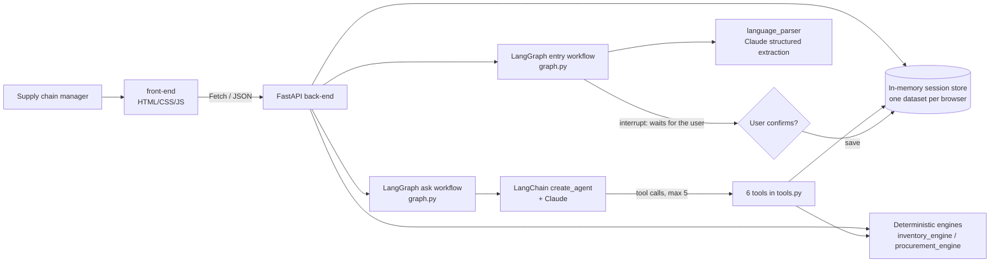
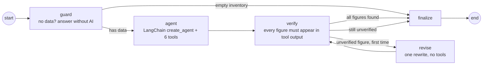
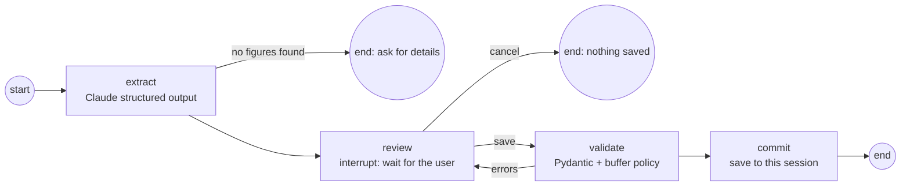

# StockWise AI
**An Intelligent Inventory Replenishment and Procurement Decision Support System**

> *StockWise AI tells businesses what to restock, how much to buy, how much it will cost, and why, using their own inventory data.*

## In plain words (for the MBA presentation)
StockWise AI is a simple web tool that helps shop owners and warehouse managers decide what to restock. Many small businesses still use spreadsheets and guesswork to answer questions like "What is about to run out?", "How much should I order?" and "What can I afford this week?". With StockWise, a manager uploads a stock spreadsheet or just types a description such as "we have 20 units and sell 10 a day". The tool then shows which products need attention, how many units to order, what that will cost, and what to buy first when money is tight. Managers can ask questions in everyday English and get a short, clear answer with the reasons behind it. Standard, checkable formulas do every calculation. The AI reads the question and explains the answer in plain language. It never makes up numbers and never places orders.

## Business problem
Small and mid-sized retailers and distributors need to know which products are running out, which to reorder, how much to buy, what it will cost, what to buy first on a limited budget, where too much money sits in excess stock, and how slower suppliers change all of this. Today this is usually worked out by hand in spreadsheets.

## Solution and architecture



- **front-end/** handles presentation only: no business calculations, only formatting of numbers the server returns.
- **back-end/** handles validation, calculations, budget allocation, scenarios, explanations, the LangGraph workflows, the LangChain agent and session isolation.
- A single server (`uvicorn`) serves both the API and the web page at one URL.

### Folder structure
```
stockwise-ai/
├── front-end/   index.html · css/styles.css · js/{api,dashboard,app}.js · assets/
├── back-end/    main.py (API + static hosting) · graph.py (LangGraph) · agent.py · tools.py · schemas.py
│                data_processing.py · inventory_engine.py · procurement_engine.py
│                language_parser.py · explanation_engine.py · session_store.py · config.py
│                data/sample_inventory.csv · tests/ · requirements.txt
├── .env.example · .gitignore · README.md
```

## Tech stack
Python 3.11+ · FastAPI · LangChain 1.x (`create_agent`) · LangGraph 1.x (`StateGraph`, `interrupt`, `InMemorySaver`) · `langchain-openrouter` / `langchain-anthropic` (Claude) · Pandas · Pydantic v2 · pytest · vanilla HTML/CSS/JS (no build step, no chart library; bar charts are drawn with CSS).

## Data-processing workflow
1. **CSV upload.** Pandas reads the file. Column names are normalised and common aliases are accepted. Every row is validated by Pydantic: required fields must be present and numbers must not be negative. Duplicate SKUs are skipped and reported.
2. **Plain-English description.** Claude extracts only the values the user stated, using structured output. Missing essentials are flagged instead of being guessed, and repeated mentions of the same product are merged. Products that already exist are marked as updates. An **editable preview** is shown, and nothing is saved until the user clicks *Save to my inventory*. This rule is enforced by the LangGraph entry workflow's `interrupt()` step (see below).
3. **Retrieval.** Inventory is structured data, so it is filtered and aggregated with Pandas/Python. **No embeddings or vector database are used.** For numeric tables they would add complexity and reduce accuracy. Supplier-contract and policy documents could later use document chunking with embedding retrieval (see Future improvements).
4. **Prompt size.** Agent tools return compact summaries or selected rows, never the whole dataset.

## Inventory calculation method (`inventory_engine.py`)
| Metric | Formula |
|---|---|
| Inventory position ("stock available and expected") | current + incoming − backorders |
| Coverage ("days stock may last") | current ÷ avg daily demand (zero demand → "no sales") |
| Safety stock | supplied value → else `ceil(Z·σ·√LT)` with Z = 1.65 (~95%) → else **default buffer of 2 days of demand (disclosed as an assumption)** |
| Reorder point | ceil(demand × lead time + safety stock) |
| Target stock | ceil(demand × (lead time + review period 7 d) + safety stock) |
| Reorder? | position ≤ reorder point **and** (demand > 0 or backorders > 0) |
| Suggested qty | ceil(target − position), whole units ≥ 0 |
| Cost | qty × unit cost (Decimal, rounded to paise) |

**Risk label priority (first match wins):** Out of Stock → Low Demand (≤ 0.5/day) → Critical (coverage < lead time, or stock < safety stock) → Order Soon (position ≤ reorder point) → Excess Stock (coverage > 60 days) → Healthy. The *needs reorder* flag is kept separate from the label.

## Procurement allocation method (`procurement_engine.py`)
This is a transparent **greedy** method, not a global optimum. Products are ranked by: stockouts → critical → other reorders → fewer days of cover → SKU (tie-breaker). Each product gets its full quantity if the budget allows; otherwise it gets as many whole units as the remaining budget can buy. Unfunded units are reported separately. An assertion guarantees that spending never exceeds the budget. Scenario tools compare two budgets, or recalculate one product with a new lead time **on a copy**, so the saved data never changes.

## LangChain agent (`agent.py`, `tools.py`)
`create_agent(ChatAnthropic, tools, system_prompt, middleware=[ToolCallLimitMiddleware(run_limit=5, exit_behavior="continue"), ModelCallLimitMiddleware(run_limit=7, exit_behavior="error")])` runs with a 60 s model timeout and at most 1 retry.
- **Tool limit.** At most 5 tools run. Calls past the limit do not run; the model is told to answer with what it already has.
- **Model-call limit.** At most 7 model calls. A model that keeps going is stopped, and the user sees *"I couldn't complete that request"*, never the library's internal limit message.
- **`recursion_limit=40`.** This is only a backstop. LangGraph counts graph steps, not turns: about 5 per tool turn including the middleware, so the call limits stop the agent by step 33.

| Tool | What it does |
|---|---|
| `get_inventory_summary` | Health counts, reorder count, stock value, total purchase cost, top-8 urgent items |
| `analyze_product` | Full analysis + plain-language explanation for one product |
| `identify_inventory_risks` | Stockouts, critical, order-soon, excess (with ₹ tied up), low demand, optional "runs out within N days" |
| `calculate_replenishment` | Reorder points, targets, quantities and costs for chosen products or all that need reordering |
| `create_purchase_plan` | Budget allocation (calls the same engine as the planner screen) |
| `compare_scenarios` | Budget A vs B, or lead-time change for one product |

The tools are **closures bound to one browser session**, so the agent cannot read another session's data. The system prompt makes Claude take every number from a tool and answer in the *What we found / Why it matters / What we recommend / Estimated cost* format. Tool usage is logged on the server. The agent cannot place orders, run code or change saved data.

## LangGraph workflows (`graph.py`)
LangChain's `create_agent` is itself built on LangGraph. On top of it, two explicit `StateGraph` workflows mix deterministic steps with the AI step. Both are compiled with an `InMemorySaver` checkpointer, and each browser session gets its own `thread_id`.

**1. Ask workflow (questions in the chat)**

- **guard** is deterministic. With no inventory loaded it returns *"We need your stock information…"* and makes no model call.
- **agent** runs the existing tool-calling agent (still limited to 5 tool calls and 7 model calls) on the last 6 chat messages. That gives follow-up questions such as *"what about Product B?"* their context. The memory is kept per session by the checkpointer.
- **verify** is deterministic. It extracts every number in the draft answer and checks it against the tool outputs and the question. Indian digit grouping (₹1,20,889), rounding (3.75 → 3.8), small whole numbers (≤10, e.g. "top 3") and the disclosed policy constants (7-day review, 2-day buffer, 95%, 1.65, 60 days) are allowed.
- **revise** runs at most once. It is a single model call with **no tools**, so the 5-tool-call limit still holds. It asks for a rewrite that uses only figures from the results.
- **finalize** stores the answer in the chat memory. If any figure is still unverified, it adds a visible note instead of hiding it. The chat shows *"Figures checked against your inventory"* when verification passes.

**2. Entry workflow (Describe your stock), with a human in the loop**

`/api/parse-inventory` runs the graph until `interrupt()` pauses it at **review**, then returns the preview. `/api/confirm-inventory` resumes it with `Command(resume={"action": "save", "items": …})`, and `/api/cancel-inventory` resumes it with `"cancel"`. If validation fails, the graph loops back to **review** and stays paused, so a bad edit never reaches the inventory. Saving is impossible without first passing through the review step.

## Deep Agents: feasibility assessment
[Deep Agents](https://docs.langchain.com/oss/python/deepagents/overview) (`deepagents` 0.7) is a ready-made agent harness built on LangChain and LangGraph. It adds planning, a virtual filesystem, sub-agents, memory and approval pauses.

**Spike result (feasible).** In a separate environment, `create_deep_agent(tools=build_tools(...), subagents=[budget-analyst])` ran with StockWise's **six tools unchanged**. The agent called `identify_inventory_risks` and `create_purchase_plan`, then wrote `/procurement_brief.md` to its virtual filesystem. `deepagents` 0.7.23 is compatible with the project's LangChain 1.4 / LangGraph 1.2.

**Decision: not used for the core features.**
| Concern | Core Q&A (`create_agent` + LangGraph) | Deep Agent |
|---|---|---|
| Tools in every prompt | 6 | 14 (adds `ls`, `read_file`, `write_file`, `edit_file`, `delete`, `glob`, `grep`, `task`) |
| Bounded execution (brief: ≤5 tool calls) | Enforced by middleware | Harder: `task` starts sub-agents, each with its own tool calls |
| Number verification | Every figure checked against raw tool output | Sub-agents return summaries, so raw figures are harder to trace |
| Typical model calls / latency | 2–3 calls, a few seconds | Planning + sub-agents + file steps: many more calls, longer waits |
| Extra dependencies | none | `deepagents` plus `google-genai`, `cryptography` and others |

**Where it would fit later:**
1. A one-click **"weekly procurement brief"**: a long, multi-section report (risks, budget scenarios, supplier delays) that is planned, delegated to sub-agents and written as a downloadable file.
2. **Supplier-document analysis** (contracts, minimum order quantities, policies), using its filesystem, skills and context offloading. This is the document extension the original brief mentions.

Either feature would run as a separate, clearly labelled, longer-running endpoint, with `interrupt_on` approvals and its own call budget.

## Explainability
Every product has a *Why this action?* panel built by `explanation_engine.py` from the calculated numbers. It shows the four-part explanation plus a collapsed, beginner-friendly breakdown of each formula with the real values and the safety-stock assumption that was used.

## Install and run
```bash
cd stockwise-ai
python3 -m venv ~/.venvs/stockwise          # a venv can't live in a path containing ":" (see note)
~/.venvs/stockwise/bin/pip install -r back-end/requirements.txt
cp .env.example .env                        # add OPENROUTER_API_KEY or ANTHROPIC_API_KEY (optional)
cd back-end
~/.venvs/stockwise/bin/uvicorn main:app --port 8000
# open http://localhost:8000
```
*Note:* Python refuses to create a venv inside a folder whose path contains `:` (this project folder is `AI:ML Project`), so the venv lives in your home folder.

**Environment variables** (in `stockwise-ai/.env`, which git ignores):
| Variable | Meaning |
|---|---|
| `OPENROUTER_API_KEY` | Use Claude through [OpenRouter](https://openrouter.ai) (`langchain-openrouter`). Takes priority if both keys are set. |
| `ANTHROPIC_API_KEY` | Use Claude directly through Anthropic (`langchain-anthropic`). |
| `AI_MODEL` | Optional. Defaults to `openrouter/free` on OpenRouter or `claude-sonnet-5-5` on Anthropic. Any model with tool calling works. |

**Free models (the OpenRouter default).** `openrouter/free` lets OpenRouter pick, per request, any available free model that supports tool calling. In live tests it used a different model almost every call (Nemotron, Apodex, Cohere North, Liquid LFM and others), and every answer passed the number check.
- **Limits.** Free models allow 20 requests/minute and **50 requests/day** (1,000/day once $10 of credit has ever been bought). One chat question uses 2–4 requests.
- **Not Claude.** The original brief asks for Claude. To use it, add OpenRouter credit and set `AI_MODEL=anthropic/claude-sonnet-5.5`. The live test of that model passed too, at about $0.006 per question.

Without a key, the dashboard, upload, planner, scenarios and export all still work, and the AI screens show *"AI questions are unavailable until the assistant is connected."*

## Example questions
- What should I order today?
- Which products are likely to run out within the next five days?
- Why is Product A at risk?
- How does our purchasing plan change if the budget increases from ₹15,000 to ₹30,000?
- Our supplier for Product A now takes eight days instead of five. How does this change our risk?
- Which products have too much stock, and how much money is tied up?

## Tests
```bash
cd back-end && ~/.venvs/stockwise/bin/python -m pytest -q tests     # 40 passed
```
These cover all mandatory demonstration scenarios 1–4 and 7 (exact expected numbers), zero demand, default/statistical safety stock, excess stock, incoming/backorders, deterministic priority, strict budget enforcement across many budgets, partial allocation, budget comparison, NL extraction with a **mocked** model (scenario 5, missing-value flagging, de-duplication, update detection), CSV upload/validation, negative rejection, duplicate SKUs, session isolation, confirmation validation, honest "AI unavailable" behaviour, real tool registration plus invocation through `create_agent` with a fake model, the 5-tool limit (a 6th call is blocked and the model still answers), and a runaway model stopping without showing the library's limit message.

LangGraph tests (`test_graph.py`, mocked models) cover:
- number grounding (accepted and flagged figures);
- the ask workflow: verified answer, a 3-tool question under the production limits, rewrite of an invented figure, a visible note when a figure stays unverified, the empty-inventory guard, and per-session chat memory;
- the entry workflow: pausing at review with nothing saved, saving after confirmation, cancel, an invalid edit looping back to review, and vague text.

| Category | Status |
|---|---|
| Automated tests (deterministic + mocked model) | ✅ 40/40 passed |
| Live AI tests via OpenRouter, `openrouter/free` (2026-10-09) | ✅ Passed: multi-tool question, follow-up using chat memory, lead time 5→8 days (Scenario 7), Shampoo extraction + confirm (Scenario 5), vague text with every figure flagged missing and none invented (Scenario 6). All chat answers passed the number check. |
| Live AI tests via OpenRouter, `anthropic/claude-sonnet-5.5` | ✅ Passed: two multi-tool questions with verified figures; the remaining checks stopped when the account ran out of credit |

## Limitations
- Session data is in memory only and is lost on server restart. There is no login or database.
- Demand is a single average with no seasonality or forecasting model.
- Budget allocation is greedy, not optimal. Minimum order quantities and supplier discounts are not modelled.
- Free models vary by request: answers are correct and checked, but they follow the answer format less strictly than Claude and can take 10–60 s.
- The number check is a heuristic. It catches invented figures, but it cannot tell whether a figure that does appear in the data is used in the right place.
- Tested for roughly 20–500 SKUs.

## Future improvements
Supplier-agreement retrieval (chunking + embeddings for MOQ and contract terms), demand forecasting, MOQ/pack-size constraints, multi-warehouse support, persistent storage with login, and an optimisation-based allocator (ILP).

## References and attribution
- Concept references: [smart-inventory-replenishment-dashboard](https://github.com/Shajidp/smart-inventory-replenishment-dashboard) (inventory analytics, reorder point and safety-stock ideas) and [Inventra](https://github.com/Balaastratech/Inventra) (agentic tool orchestration and structured responses). **No code was copied from either repository.** All code here is original, and the formulas are standard textbook operations-management methods.
- [LangChain](https://docs.langchain.com/oss/python/langchain/overview), [LangGraph](https://docs.langchain.com/oss/python/langgraph/overview), [Deep Agents](https://docs.langchain.com/oss/python/deepagents/overview), [LangChain agents docs](https://docs.langchain.com/oss/python/langchain/agents), [langchain-anthropic](https://docs.langchain.com/oss/python/integrations/chat/anthropic), [FastAPI](https://fastapi.tiangolo.com/).
- The sample dataset is **synthetic demonstration data**.
