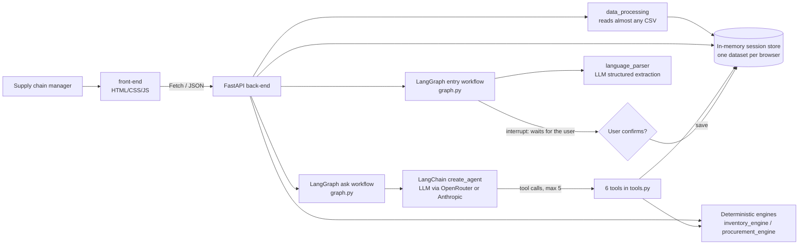
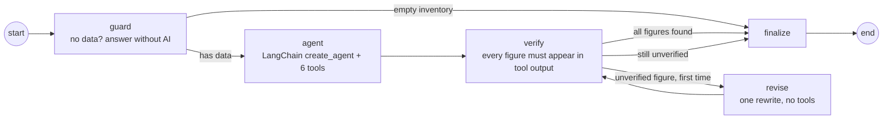
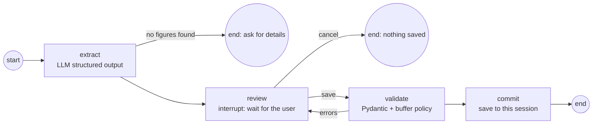

# StockWise AI
**An Intelligent Inventory Replenishment and Procurement Decision Support System**

> *StockWise AI tells businesses what to restock, how much to buy, how much it will cost, and why, using their own inventory data.*

## In plain words (for the MBA presentation)
StockWise AI is a simple web tool that helps shop owners and warehouse managers decide what to restock. Many small businesses still use spreadsheets and guesswork to answer questions like "What is about to run out?", "How much should I order?" and "What can I afford this week?".

With StockWise, a manager uploads almost any stock or sales spreadsheet, or simply types a description such as "we have 20 units and sell 10 a day". The tool then shows which products need attention, how many units to order, what that will cost, and what to buy first when money is tight. Managers can ask questions in everyday English and get a short, clear answer with the reasons behind it.

Standard, checkable formulas do every calculation. The AI only reads the question and explains the answer in plain language. It never makes up numbers and never places orders.

## Business problem
Small and mid-sized retailers and distributors need to know:
- which products are running out, and which to reorder;
- how much to buy, and what it will cost;
- what to buy first on a limited budget;
- where too much money sits in excess stock;
- how slower suppliers change all of this.

Today this is usually worked out by hand in spreadsheets.

## Features
| Screen | What the manager gets |
|---|---|
| **Overview** | Four headline numbers (products, need to reorder, may run out soon, estimated purchase cost) and a **stock runway** chart: how long each urgent product will last compared with when the supplier delivers. Demo data is loaded on first visit. |
| **Add inventory** | Upload **almost any CSV**: different column names, separators and number formats, per-warehouse files or daily sales histories. The app then shows **"How we read your file"**. If a required column is missing, a **"Help us read your file"** form asks for it. Alternatively, **describe your stock in plain English** and confirm an editable table; nothing is saved until you confirm. |
| **Inventory health** | Every product, most urgent first, with status filters. Each row has a **"Why this action?"** panel (What we found / Why it matters / What we recommend / Estimated cost) and a beginner-friendly "How was this calculated?". |
| **Plan purchases** | Enter a budget and get what to buy, in priority order, without ever exceeding it. Shows what is fully covered, partly covered and unfunded. **CSV download.** "What if" comparisons for a different budget or a slower supplier. |
| **Ask StockWise** | Chat in plain English, with follow-up questions. Answers come with *"Figures checked against your inventory"* when every number matches the calculations. |

Everything except the two AI features (describe-your-stock and chat) works **without an AI key**.

## Solution and architecture



- **front-end/** handles presentation only. It does no business calculations; it only formats numbers the server returns.
- **back-end/** handles file reading, validation, calculations, budget allocation, scenarios, explanations, the LangGraph workflows, the LangChain agent and session isolation.
- A single server (`uvicorn`) serves both the API and the web page at one URL.

### Folder structure
```
stockwise-ai/
├── front-end/   index.html · css/styles.css · js/{api,dashboard,app}.js · assets/
├── back-end/    main.py (API + static hosting) · graph.py (LangGraph) · agent.py · tools.py · schemas.py
│                data_processing.py · inventory_engine.py · procurement_engine.py
│                language_parser.py · explanation_engine.py · session_store.py · config.py
│                data/sample_inventory.csv · tests/ · requirements.txt
├── .env.example · .gitignore · README.md          (.env with your key stays local; git ignores it)
```

## Tech stack
- **Back end:** Python 3.11+, FastAPI, Pandas, Pydantic v2, pytest.
- **AI orchestration:** LangChain 1.x (`create_agent`) and LangGraph 1.x (`StateGraph`, `interrupt`, `InMemorySaver`).
- **Models:** `langchain-openrouter` (OpenRouter free models by default) or `langchain-anthropic` (Claude).
- **Front end:** vanilla HTML/CSS/JS, with no build step and no chart library (bar charts are drawn with CSS).

## Data-processing workflow
1. **CSV upload: almost any inventory CSV** (`data_processing.py`).
   - **Reading.** Any separator (`,` `;` tab `|`), UTF-8/BOM or Windows encodings, and title lines above the header (the header row is detected). Numbers written like `₹1,20,889`, `1.250,50` (semicolon files), `1,200 units`, `2 weeks` or `N/A` are understood. Excel files get a "save as CSV" message.
   - **Columns.** Exact names are matched first, then keyword rules:

     | Header in the file | Read as |
     |---|---|
     | `Qty on Hand`, `SOH`, `Inventory Level` | stock |
     | `Weekly Sales` | daily sales (÷ 7) |
     | `Lead Time (weeks)` | lead time in days (× 7) |
     | `Vendor` | supplier |
     | `std_daily_demand` | sales variability |
     | `Reorder Level`, `Min Stock`, `reorder_point` | minimum stock level |
     | `Max Stock`, `Maximum Stock` | maximum stock level |

     Holding and reorder costs are never taken as the unit cost, order sizes such as `Min Order Qty` are never taken as stock levels, peak or maximum sales are never taken as average sales, and text columns are never read as numbers.
   - **File shapes.**
     - One row per product.
     - One row per product per warehouse: stock and sales are added up.
     - **A dated sales history:**
       - average daily sales = total sales ÷ days covered (a day with no row counts as zero sales);
       - variability = day-to-day spread;
       - stock = each location's latest figure, added up.
     - Cross-check: on the reference repo's raw 10 MB history (109,400 rows), this gives exactly the repo's own processed values (618.33/day, σ 153.03 for P001).
   - **Missing required column.** The user picks the matching column or enters one value for every product, which is then labelled "entered by you". Values are never guessed.
   - **Transparency.** After every upload the user sees **"How we read your file"**: each renamed or converted column, the detected file shape and any value they entered.
   - **Validation.** Every row is validated by Pydantic (required fields present, no negatives). Bad rows and duplicate SKUs are skipped and reported. The limits are 25 MB and 5,000 products.
2. **Plain-English description.** The model extracts only the values the user stated, using structured output.
   - Missing essentials are flagged instead of being guessed.
   - Repeated mentions of the same product are merged, and products that already exist are marked as updates.
   - An **editable preview** is shown, and nothing is saved until the user clicks *Save to my inventory*. The LangGraph entry workflow's `interrupt()` step enforces this (see below).
3. **Retrieval.** Inventory is structured data, so it is filtered and aggregated with Pandas/Python. **No embeddings or vector database are used.** For numeric tables they would add complexity and reduce accuracy. Supplier-contract and policy documents could later use document chunking with embedding retrieval (see Future improvements).
4. **Prompt size.** Agent tools return counts and totals over all products, but list at most the 10 most urgent per group (`tools.TOP`). With 2,000 products, a risk check sends about 4k tokens instead of about 139k.

## Inventory calculation method (`inventory_engine.py`)
| Metric | Formula |
|---|---|
| Inventory position ("stock available and expected") | current + incoming − backorders |
| Available stock | current − backorders (units already owed to customers are not available to sell) |
| Coverage ("days stock may last") | available ÷ avg daily demand (zero demand → "no sales") |
| Safety stock | supplied value → else `ceil(Z·σ·√LT)` with Z = 1.65 (~95%) → else **default buffer of 2 days of demand (disclosed as an assumption)** |
| Reorder point | ceil(demand × lead time + safety stock), raised to the file's **minimum stock level** (e.g. `Reorder Level`) if it has one |
| Target stock | ceil(demand × (lead time + review period 7 d) + safety stock), at least the reorder point; capped at the file's **maximum stock level** if it has one, but never below the reorder point |
| Reorder? | position ≤ reorder point **and** (demand > 0 or backorders > 0) **and** the label is not Low Demand **and** at least one unit to order |
| Suggested qty | ceil(target − position), whole units ≥ 0 |
| Next order due | floor((position − reorder point) ÷ demand) days, shown for products that need no order yet |
| Cost | qty × unit cost (Decimal, rounded to paise) |

**Risk label priority (first match wins):**
1. Out of Stock (nothing available to sell, and there is demand or customers are still owed units)
2. Low Demand (≤ 0.5/day)
3. Critical (coverage < lead time, or available stock < safety stock)
4. Order Soon (position ≤ reorder point)
5. Excess Stock (coverage > 60 days)
6. Healthy

Low Demand products are never reordered: their sales are too slow to justify new stock, so they stay out of the purchase plan. A product with slow sales that is completely out of stock is labelled Out of Stock (rule 1) and is still reordered.

## Procurement allocation method (`procurement_engine.py`)
This is a transparent **greedy** method, not a global optimum.
- **Ranking:** stockouts → critical → other reorders → fewer days of cover → more sales lost per day (demand × selling price, or × unit cost when no price is given) → SKU (tie-breaker).
- **Funding:** each product gets its full quantity if the budget allows; otherwise it gets as many whole units as the remaining budget can buy. Unfunded units are reported separately.
- **Budget guarantee:** an assertion ensures spending never exceeds the budget.
- **Scenarios:** compare two budgets, or recalculate one product with a new lead time **on a copy**, so the saved data never changes.

## LangChain agent (`agent.py`, `tools.py`)
`create_agent(get_model(), tools, system_prompt, middleware=[ToolCallLimitMiddleware(run_limit=5, exit_behavior="continue"), ModelCallLimitMiddleware(run_limit=7, exit_behavior="error")])`
- **Model.** `get_model()` returns `ChatOpenRouter` when `OPENROUTER_API_KEY` is set, otherwise `ChatAnthropic`. Both features use this one factory, with temperature 0, a 60 s timeout and at most 1 retry. OpenRouter's timeout is in milliseconds, Anthropic's in seconds, and the code handles both.
- **Tool limit.** At most 5 tools run. Calls past the limit do not run; the model is told to answer with what it already has.
- **Model-call limit.** At most 7 model calls. A model that keeps going is stopped, and the user sees *"I couldn't complete that request"*, never the library's internal limit message.
- **`recursion_limit=40`.** This is only a backstop. LangGraph counts graph steps, not turns: about 5 per tool turn including the middleware, so the call limits stop the agent by step 33.

| Tool | What it does |
|---|---|
| `get_inventory_summary` | Health counts, reorder count, stock value, total purchase cost, top-8 urgent items |
| `analyze_product` | Full analysis + plain-language explanation for one product |
| `identify_inventory_risks` | Stockouts, critical, order-soon, excess (ordered by ₹ tied up), low demand, optional "runs out within N days": count of each + the 10 most urgent |
| `calculate_replenishment` | Reorder points, targets, quantities and costs for chosen products or all that need reordering: total count and cost + the 10 most urgent |
| `create_purchase_plan` | Budget allocation (calls the same engine as the planner screen) |
| `compare_scenarios` | Budget A vs B, or lead-time change for one product |

**Safety:**
- **Session isolation.** The tools are **closures bound to one browser session**, so the agent cannot read another session's data.
- **Figures and format.** The system prompt makes the model take every number from a tool and answer in the *What we found / Why it matters / What we recommend / Estimated cost* format.
- **Logging.** Tool usage is logged on the server.
- **No side effects.** The agent cannot place orders, run code or change saved data.

## LangGraph workflows (`graph.py`)
LangChain's `create_agent` is itself built on LangGraph. On top of it, two explicit `StateGraph` workflows mix deterministic steps with the AI step. Both are compiled with an `InMemorySaver` checkpointer, and each browser session gets its own `thread_id`.

**1. Ask workflow (questions in the chat)**

- **guard** is deterministic. With no inventory loaded it returns *"We need your stock information…"* and makes no model call.
- **agent** runs the tool-calling agent (limited to 5 tool calls and 7 model calls) on the last 6 chat messages. That gives follow-up questions such as *"and if the budget doubles?"* their context. The memory is kept per session by the checkpointer.
- **verify** is deterministic. It extracts every number in the draft answer and checks it against the tool outputs and the question. It allows:
  - Indian digit grouping (₹1,20,889);
  - rounding (3.75 → 3.8);
  - small whole numbers (≤ 10, e.g. "top 3");
  - the disclosed policy constants (7-day review, 2-day buffer, 95%, 1.65, 60 days).
- **revise** runs at most once. It is a single model call with **no tools**, so the 5-tool-call limit still holds. It asks for a rewrite that uses only figures from the results.
- **finalize** stores the answer in the chat memory. If any figure is still unverified, it adds a visible note instead of hiding it.

**2. Entry workflow (Describe your stock), with a human in the loop**

- `/api/parse-inventory` runs the graph until `interrupt()` pauses it at **review**, then returns the preview.
- `/api/confirm-inventory` resumes it with `Command(resume={"action": "save", "items": …})`.
- `/api/cancel-inventory` resumes it with `"cancel"`.
- If validation fails, the graph loops back to **review** and stays paused, so a bad edit never reaches the inventory. Saving is impossible without first passing through the review step.

## Deep Agents: feasibility assessment
[Deep Agents](https://docs.langchain.com/oss/python/deepagents/overview) (`deepagents` 0.7) is a ready-made agent harness built on LangChain and LangGraph. It adds planning, a virtual filesystem, sub-agents, memory and approval pauses.

**Spike result: feasible.** In a separate environment, `create_deep_agent(tools=build_tools(...), subagents=[budget-analyst])` ran with StockWise's **six tools unchanged**. The agent called `identify_inventory_risks` and `create_purchase_plan`, then wrote `/procurement_brief.md` to its virtual filesystem. `deepagents` 0.7.23 is compatible with the project's LangChain 1.4 / LangGraph 1.2.

**Decision: not used for the core features.**
| Concern | Core Q&A (`create_agent` + LangGraph) | Deep Agent |
|---|---|---|
| Tools in every prompt | 6 | 14 (adds `ls`, `read_file`, `write_file`, `edit_file`, `delete`, `glob`, `grep`, `task`) |
| Bounded execution (brief: ≤5 tool calls) | Enforced by middleware | Harder: `task` starts sub-agents, each with its own tool calls |
| Number verification | Every figure checked against raw tool output | Sub-agents return summaries, so raw figures are harder to trace |
| Typical model calls / latency | 2–3 calls | Planning + sub-agents + file steps: many more calls, longer waits |
| Extra dependencies | none | `deepagents` plus `google-genai`, `cryptography` and others |

**Where it would fit later:**
1. A one-click **"weekly procurement brief"**: a long, multi-section report (risks, budget scenarios, supplier delays) that is planned, delegated to sub-agents and written as a downloadable file.
2. **Supplier-document analysis** (contracts, minimum order quantities, policies), using its filesystem, skills and context offloading. This is the document extension the original brief mentions.

Either feature would run as a separate, clearly labelled, longer-running endpoint, with `interrupt_on` approvals and its own call budget.

## Explainability
- **Per product:** every product has a *Why this action?* panel built by `explanation_engine.py` from the calculated numbers. It shows the four-part explanation plus a collapsed, beginner-friendly breakdown of each formula, with the real values and the safety-stock assumption that was used.
- **Per upload:** "How we read your file" lists exactly how each column was interpreted.
- **Per chat answer:** a "Figures checked" tag shows that every number matched the calculations.

## Install and run
```bash
cd stockwise-ai
python3 -m venv ~/.venvs/stockwise          # a venv can't live in a path containing ":" (see note)
~/.venvs/stockwise/bin/pip install -r back-end/requirements.txt
cp .env.example .env                        # then paste your key after OPENROUTER_API_KEY= (optional)
cd back-end
~/.venvs/stockwise/bin/uvicorn main:app --port 8000
# open http://localhost:8000
```
*Note:* Python refuses to create a venv inside a folder whose path contains `:` (this project folder is `AI:ML Project`), so the venv lives in your home folder. After changing `.env`, restart the server.

**Environment variables** (in `stockwise-ai/.env`, which git ignores):
| Variable | Meaning |
|---|---|
| `OPENROUTER_API_KEY` | Use [OpenRouter](https://openrouter.ai/keys) (`langchain-openrouter`). A free account is enough for the default free models. Takes priority if both keys are set. |
| `ANTHROPIC_API_KEY` | Use Claude directly through Anthropic (`langchain-anthropic`). |
| `AI_MODEL` | Optional. Defaults to `openrouter/free` on OpenRouter or `claude-sonnet-5-5` on Anthropic. Any model with tool calling works. |

**Free models (the OpenRouter default).** `openrouter/free` lets OpenRouter pick, per request, any available free model that supports tool calling. In live tests it used a different model almost every call (Nemotron, Apodex, Cohere North, Liquid LFM and others), and every answer passed the number check.
- **Limits.** 20 requests/minute and **50 requests/day** (1,000/day once $10 of credit has ever been bought). One chat question uses 2–4 requests, so test a few questions before a live demo.
- **Not Claude.** The original brief asks for Claude. To use it, add OpenRouter credit and set `AI_MODEL=anthropic/claude-sonnet-5.5`. The live test of that model passed too, at about $0.006 per question.

Without a key, the dashboard, upload, planner, scenarios and export all still work, and the AI screens show *"AI questions are unavailable until the assistant is connected."*

## 90-second demo
1. **Overview (15 s).** The headline cards and the stock runway: Product A's stock lasts 2 days, but delivery takes 5, a 3-day gap.
2. **Why? (15 s).** In Inventory health, choose *"Why this action?"* on Product A: order 110 units for ₹11,000, with the calculation shown.
3. **Budget (15 s).** Plan purchases with ₹25,000. Both out-of-stock products are fully covered (Toor Dal 115 units, Product C 45), Product A gets 4 of its 110, and the rest is listed as unfunded; download the CSV.
4. **What if (10 s).** Product A's supplier takes 8 days instead of 5: the order rises to 140 units for ₹14,000, and the saved data is unchanged.
5. **Any spreadsheet (15 s).** Upload a CSV (for example a daily sales history) and show "How we read your file". Or describe *"50 units of Shampoo, sell 8 a day, 6-day delivery, ₹120 each"* and confirm the table.
6. **Ask (20 s).** "Which products may run out in the next five days, and what can I buy with ₹12,000?", then "And if that budget doubles?". Point to the *Figures checked* tag.

## Example questions
- What should I order today?
- Which products are likely to run out within the next five days?
- Why is Product A at risk?
- How does our purchasing plan change if the budget increases from ₹15,000 to ₹30,000?
- Our supplier for Product A now takes eight days instead of five. How does this change our risk?
- Which products have too much stock, and how much money is tied up?

## Tests
```bash
cd back-end && ~/.venvs/stockwise/bin/python -m pytest -q tests     # 73 passed
```
| File | Covers |
|---|---|
| `test_inventory.py`, `test_procurement.py` | Demonstration scenarios 1–4 and 7 with exact expected numbers; zero demand; default/statistical safety stock; excess stock; incoming stock; backorders reducing available stock; minimum/maximum stock levels; next order due; deterministic priority and sales-value tie-break; strict budget enforcement across many budgets; partial allocation; budget comparison; tool output staying small for 2,000 products |
| `test_csv_formats.py` | One deliberately different CSV per case: semicolon + BOM + decimal commas; tab-separated Windows-encoded file with title lines; weekly sales and lead time in weeks; sales history across stores; per-warehouse file; analytics export with text columns; messy numbers; codes without names; Excel file; a missing column (asked for, never guessed); retail-forecasting-style dataset through the API |
| `test_language_parser.py` | Plain-English extraction with a **mocked** model: Scenario 5, missing-value flagging, de-duplication, update detection |
| `test_graph.py` | Number grounding. Ask workflow: verified answer, a 3-tool question under the production limits, rewrite of an invented figure, visible note when a figure stays unverified, empty-inventory guard, per-session chat memory. Entry workflow: pause at review with nothing saved, save after confirmation, cancel, invalid edit looping back to review, vague text |
| `test_api.py` | Upload and validation, session isolation, confirmation flow, honest "AI unavailable" behaviour, real tool registration, the 5-tool limit, a runaway model stopping cleanly, the OpenRouter/Anthropic switch |

Unit tests never call a live model: `conftest.py` blanks any real key.

| Category | Status |
|---|---|
| Automated tests (deterministic + mocked model) | ✅ 73/73 passed |
| Real CSV files | ✅ A 2,000-product inventory (0.1 s) and the reference repo's three CSVs, including its 10 MB / 109,400-row sales history (under 1 s, matching its own processed figures). The full upload → "Help us read your file" → analysis flow was checked in a real browser |
| Live AI via OpenRouter, `openrouter/free` (2026-10-09) | ✅ Multi-tool question; follow-up using chat memory; lead time 5→8 days (Scenario 7); Shampoo extraction + confirm (Scenario 5); vague text with every figure flagged missing and none invented (Scenario 6); a question over the 2,000-product file. All chat answers passed the number check |
| Live AI via OpenRouter, `anthropic/claude-sonnet-5.5` | ✅ Two multi-tool questions with verified figures; the remaining checks stopped when the account ran out of credit |

## Limitations
- Session data is in memory only and is lost on server restart. There is no login or database.
- Demand is a single average with no seasonality or forecasting model.
- Budget allocation is greedy, not optimal. Minimum order quantities, pack sizes and supplier discounts are not modelled.
- Stock value and excess value use the current unit cost (what it would cost to buy again), not an accounting valuation such as FIFO or moving average.
- Warehouses are added together; recommendations are per product, not per warehouse.
- Files up to 25 MB and 5,000 products. Excel files must be saved as CSV. In semicolon-separated files, a number like `1.200` with no decimal comma is read as 1.2.
- Free models vary by request. Answers are checked, but they follow the answer format less strictly than Claude and can take 10–60 s.
- The number check is a heuristic. It catches invented figures, but it cannot tell whether a figure that does appear in the data is used in the right place.

## Future improvements
- Supplier-agreement retrieval (chunking + embeddings for minimum order quantities and contract terms)
- Demand forecasting with seasonality
- Minimum-order and pack-size constraints
- Per-warehouse recommendations
- Persistent storage with login
- An optimisation-based allocator (ILP)

## References and attribution
- Concept references: [smart-inventory-replenishment-dashboard](https://github.com/Shajidp/smart-inventory-replenishment-dashboard) (inventory analytics, reorder point and safety-stock ideas; its CSVs were used as real-world test files) and [Inventra](https://github.com/Balaastratech/Inventra) (agentic tool orchestration and structured responses). **No code was copied from either repository.** All code here is original, and the formulas are standard textbook operations-management methods.
- Engine refinements were checked against these repositories, again **as concepts only (no code copied)**:
  - [InvenTree](https://github.com/inventree/InvenTree): stock owed to customers is not available stock; per-product minimum and maximum stock levels.
  - [agentic-inventory-management](https://github.com/Jagannath-K/agentic-inventory-management): honouring a file's own reorder point and maximum stock; days until the next order (its stock file was used as a real-world test file).
  - [ai-inventory-forecasting-business-applications](https://github.com/hyunnjjung/ai-inventory-forecasting-business-applications): revenue-aware priority, used here only as the tie-break between equally urgent products.
  - [Frappe Books](https://github.com/frappe/books): stock valuation methods (FIFO, moving average), which led to the valuation note under Limitations.
  - [Inventory-Management-System](https://github.com/jonathanrao99/Inventory-Management-System), [Inventory-Management-Using-GenAI](https://github.com/Mukku27/Inventory-Management-Using-GenAI) and [inventory-optimization-ai](https://github.com/AdamJChen/inventory-optimization-ai) were reviewed; their fixed low-stock thresholds, EOQ with assumed ordering and holding costs, and ML or reinforcement-learning forecasting were **not adopted**, because StockWise never assumes costs and forecasting is a future improvement.
- [LangChain](https://docs.langchain.com/oss/python/langchain/overview), [LangGraph](https://docs.langchain.com/oss/python/langgraph/overview), [Deep Agents](https://docs.langchain.com/oss/python/deepagents/overview), [LangChain agents](https://docs.langchain.com/oss/python/langchain/agents), [langchain-openrouter](https://docs.langchain.com/oss/python/integrations/chat/openrouter), [langchain-anthropic](https://docs.langchain.com/oss/python/integrations/chat/anthropic), [OpenRouter limits](https://openrouter.ai/docs/api-reference/limits), [FastAPI](https://fastapi.tiangolo.com/).
- The sample dataset is **synthetic demonstration data**.
